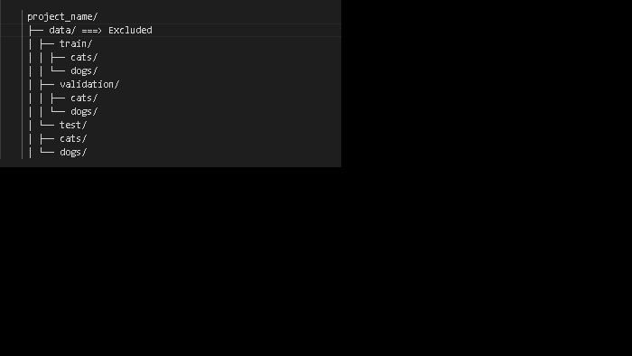

# tensorFlow-image-classifier-test

## Notes regarding image sample size

- 1. Sample size of 1000 images per feature/input
- 2. Sample sizes split as follows per feature/input
  - Training: 70% of feature/input
  - Validation: 15% of feature/input
  - Testing: 15% of feature/input
- 3. Sample images collectively to large to push to Github and has been excluded from remote push
- 4. Sample images dataset can be located [`here`](https://www.tensorflow.org/datasets/catalog/cats_vs_dogs)
- 5. Data directory structure excluded from push is as follows:

